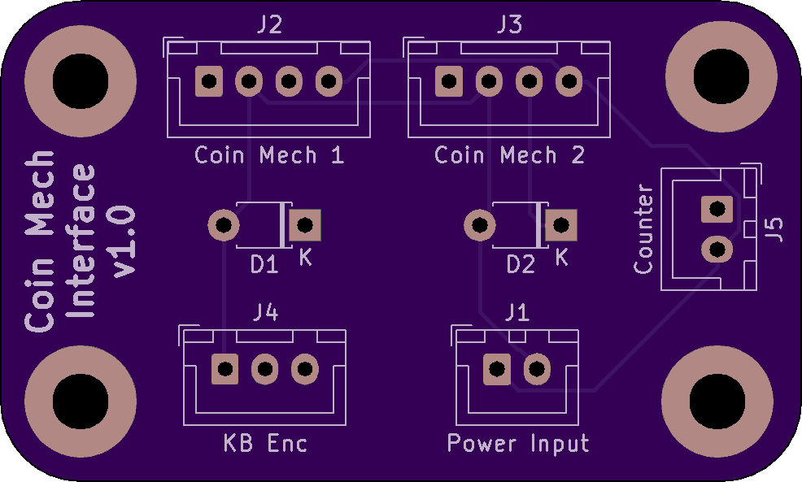
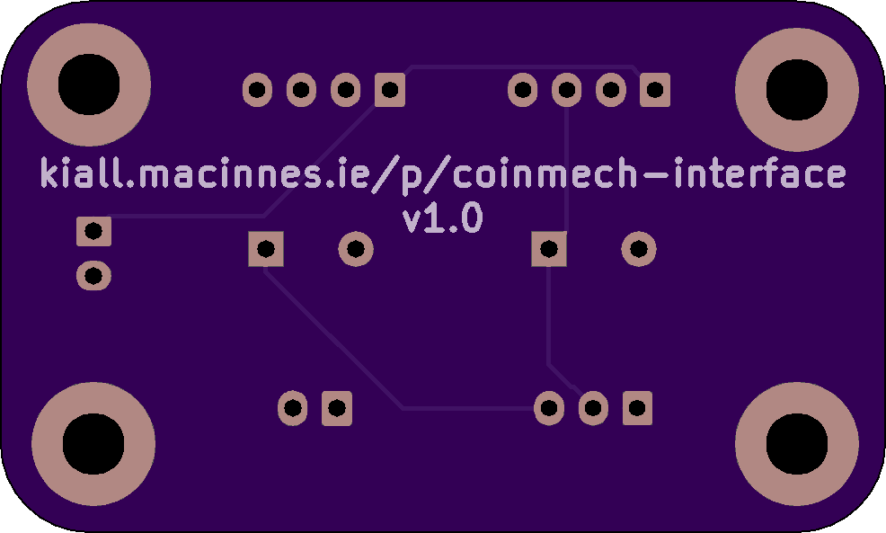
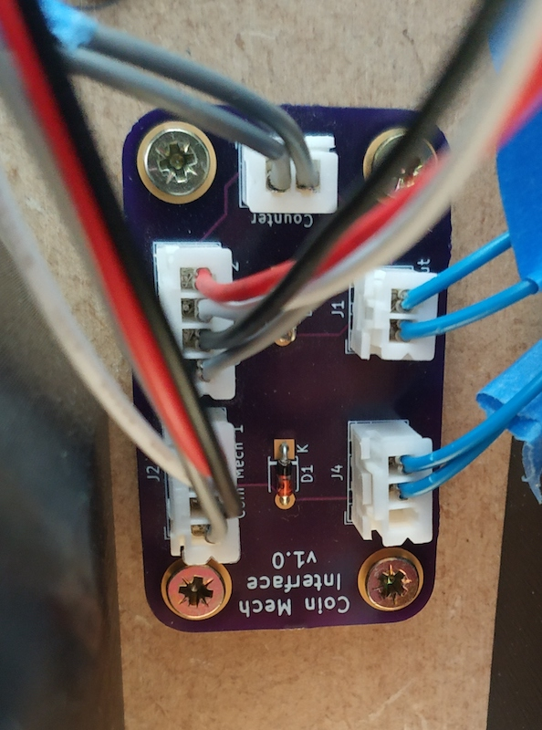
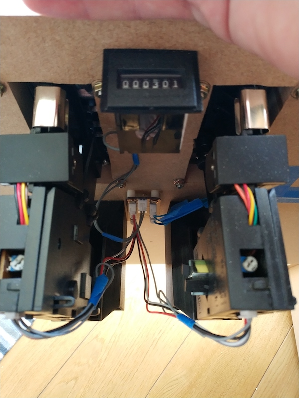

# Arcade Coin Mechanism Interface

This is a simple little interface board to connect a 12V arcade coin mechanism to a 5V interface board (e.g. the Ultimarc I-Pac). The board supports connecting 2x 12V coin mechanism, and 1x 12V Coin Counter.

# Parts Needed

1. The PCB itself (See below)
2. 2x JST-XH 4 pin sockets
3. 2x JST-XH 2 pin sockets
4. 1x JST-XH 2 pin sockets
5. 2x 5V Zener Diodes

I use JST-XH sockets everywhere, but any socket with a 2.54mm pitch and approximatly the same outside will do just fine.

# Assembly

1. Place the 2x Zener Diodes into their spots (D1 and D2) and solder in place. Ensure the stripe on the diode is on the correct side - match the orientation shown on the PCB itself.
2. Place the JST-XH connectors.
   1. Pay attention to the orientation, the markings on the PCB show which direction the socket should go, look at the slots in the connector. If using a different connector type, just be consistent in which way you orient the connectors!
   2. Place all connectors at once, then carefully turn the board upside down and allow it to rest on the connectors.
   3. Solder all the pins.
3. Your done assembling the board!

# Wiring

## Coin Mechanism 1 & 2 Sockets - J2 & J3

* Pin 1 (Square Pad): Coin Mech "Counter" wire.
* Pin 2: Coin Mech "Ground" wire.
* Pin 2: Coin Mech "Coin" wire.
* Pin 4: Coin Mech "12V" wire.

## Counter Socket - J5

*Generally, the wires on a coin counter are identical and it doesn't actually matter which way around you wire them.*

* Pin 1 (Square Pad): Coin Counter 12V Supply
* Pin 2: Coin Counter Increment Signal

## KB Enc Socket - J4

* Pin 1 (Square Pad): Keyboard Encoder Ground (e.g. I-PAC Ground Loop)
* Pin 2: Keyboard Encoder Coin 1 Input
* Pin 3: Keyboard Encoder Coin 2 Input

## Power Input Socket - J1

* Pin 1 (Square Pad): 12V from Power Supply
* Pin 2: Ground from Power Supply

# Where to get one

I don't sell these! The design is Open Source. I upload my designs to OSH Park and have them manafacture the board for me, I've included a link below.

(I do not earn comission etc from OSH Park if you order)